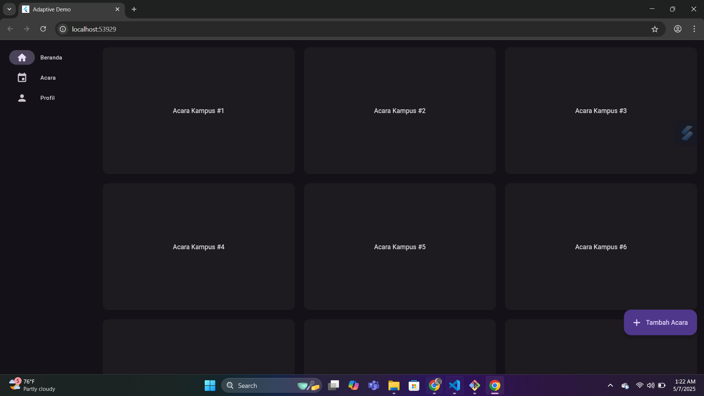

# Aplikasi Flutter 3 Halaman - Kelompok 9

## Deskripsi Aplikasi:

aplikasi ini adalah contoh sederhana penggunaan flutter_adaptive_scaffold untuk membangun
aplikasi Flutter yang responsif dan adaptif pada berbagai ukuran layar (mobile, tablet, desktop).

## Screenshot tampilan:

### tampilan website

## Penjelasan Tiap tampilan:

- **Tampilan website: Pada perangkat dengan layar lebar seperti komputer desktop, daftar acara ditampilkan dalam format grid dengan beberapa kartu acara yang tersusun rapi.
  Setiap kartu merepresentasikan satu kegiatan kampus dan disusun secara horizontal dan vertikal, memungkinkan pengguna melihat banyak informasi sekaligus tanpa perlu banyak menggulir halaman.
  Navigasi utama berada di sisi kiri dalam bentuk sidebar, lengkap dengan ikon dan teks seperti Beranda, Acara, dan Profil untuk memudahkan akses antar halaman.
  Tombol aksi mengambang (FAB) terletak di pojok kanan bawah, ditampilkan dalam bentuk tombol berwarna ungu bertuliskan "Tambah Acara", bukan hanya ikon, agar lebih informatif di layar besar.
  Tampilan menggunakan tema gelap dengan teks terang untuk menciptakan kesan modern serta memastikan keterbacaan yang baik.**
